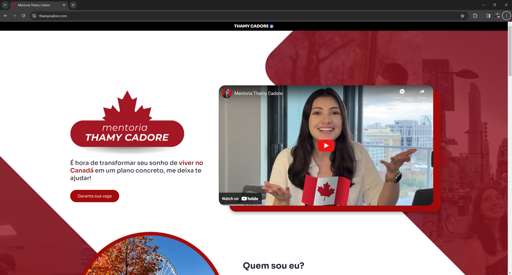
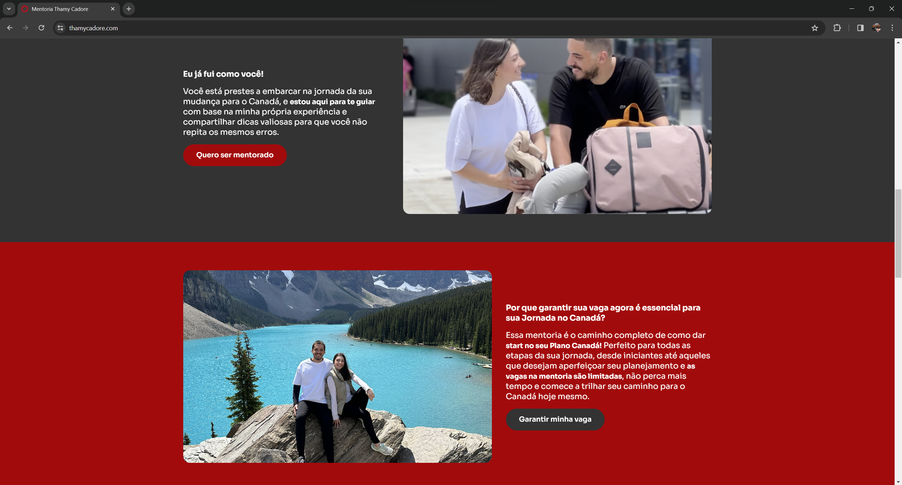
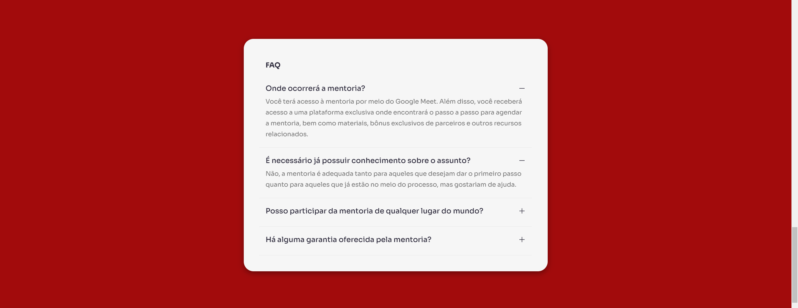
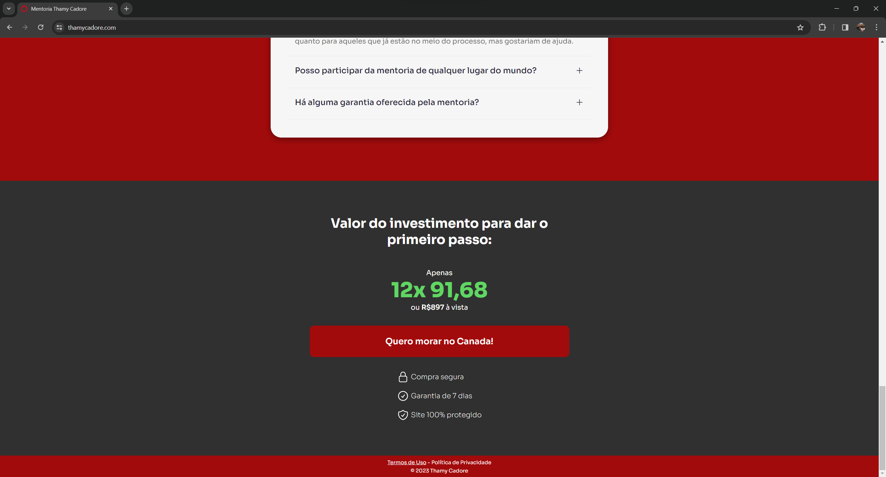

# Mentoring Service Landing Page

Welcome to my GitHub repository, where I showcase my web design skills with a visually engaging and responsive Landing Page Design.

## Live Demo

Explore a live version [here](https://thamycadore.com/).

## Screenshots

## Project Highlights

✨ **Design**: I've created an aesthetically pleasing and user-friendly homepage.

📱 **Responsiveness**: The design adapts seamlessly to various screen sizes.

🌟 **Intuitive Layout**: Easy navigation and clear user interface.

## Technologies Used

- **Vite**: Speeds up development and enhances project efficiency.
- **React**: Powers the user interface with responsive, reusable components.

## Contact

For inquiries or further discussions, please reach out to:

👤 **Hector Bernstorff**

📧 **hector.hmb@hotmail.com**

Thanks for exploring my e-commerce jewelry homepage design.
